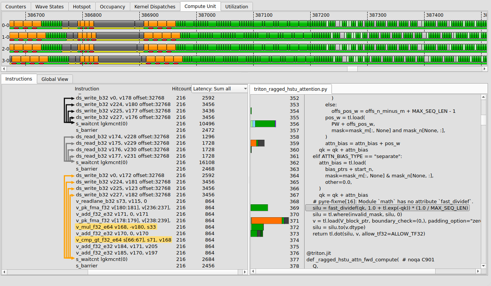
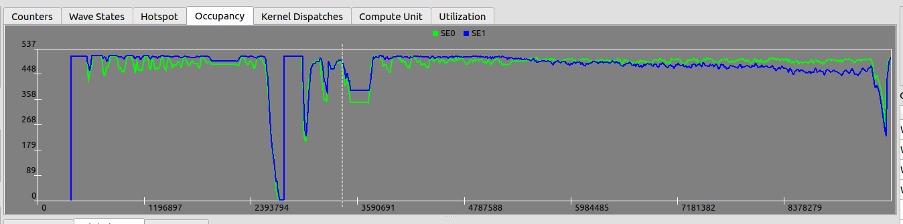
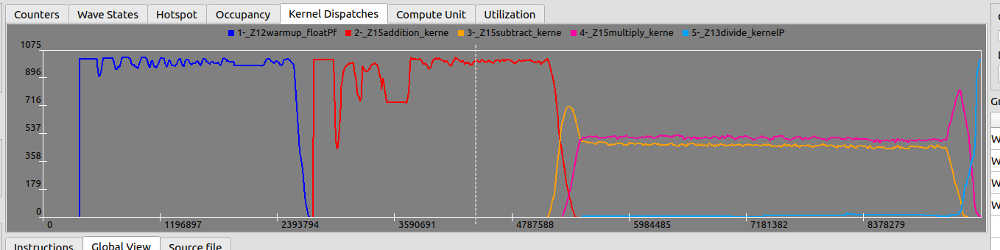
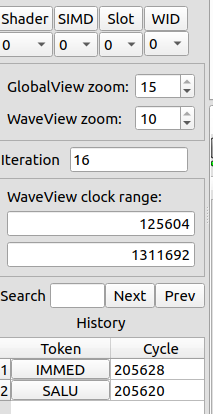
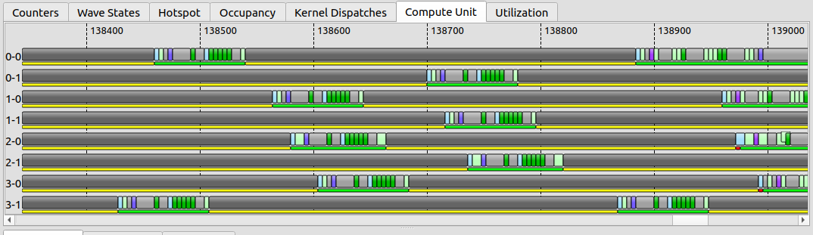
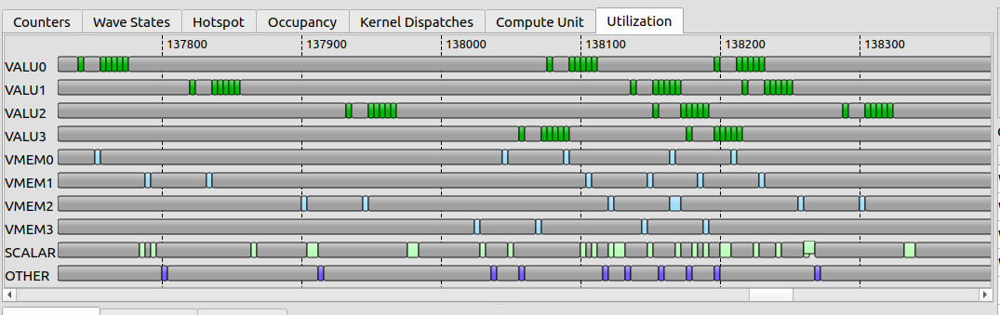
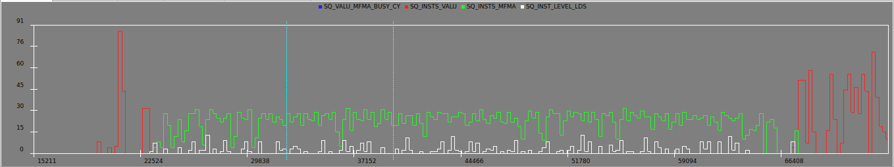
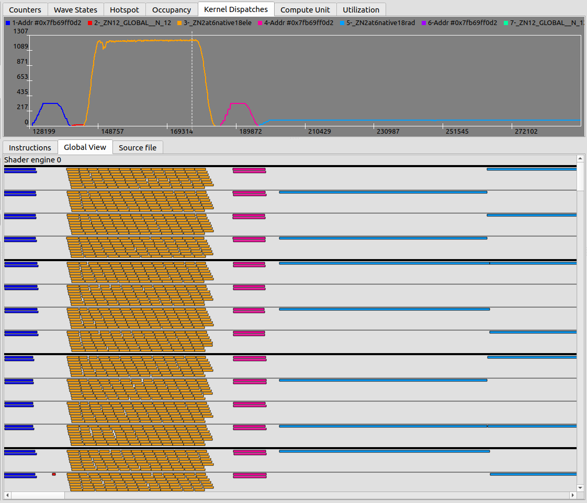

# ROCprof Compute Viewer

For pre-build binaries, see [releases](https://github.com/ROCm/rocprof-compute-viewer/releases)

## Table of Contents
- [Summary](#summary)
  - [Requirements](#requirements)
- [Rocprof Compute Viewer](#using-the-rocprof-compute-viewer)
  - [Hotspot Tab](#hotspot-tab)
  - [Instructions View](#instructions-view)
  - [Wave States and Plots](#wave-states-occupancy-and-dispatches-plots-tab)
  - [Left Side Panel](#left-side-panel)
  - [Compute Unit and Utilization Views](#compute-unit-and-utilization-views)
  - [Global View](#global-view)
  - [Summary](#summary)
  - [Explorer View](#explorer-view)
- [Troubleshooting](#troubleshooting)
- [Building from Source](#building-from-source)

## Summary

ROCprof Compute Viewer (RCV) is a tool for visualizing and analyzing GPU thread trace data collected using rocprofv3.
The tool interprets the rocprofv3 thread trace output, which are directories named ui_output\_agent\_{agent_id}\_dispatch\_{dispatch_id}. It includes:

* Trace -> ISA -> Source visualization
* Hotspot analysis.
* Memory ops to waitcnt dependency.
* Occupancy visualization

To open a UI directory, use:
* Menu -> Import -> Rocprofv3 UI,
* or paste the full path to "Ui path",
* or launch the viewer from the command line with:

```bash
./rocprof-compute-viewer <dir_to_ui_folder>
```

For information on how to generate thread trace data, see the documentation on [using rocprofv3 to collect thread trace](https://rocm.docs.amd.com/projects/rocprofiler-sdk/en/amd-mainline/how-to/using-thread-trace.html). Also, see the [ROCprof Compute Viewer documentation](https://rocm.docs.amd.com/projects/rocprof-compute-viewer/en/amd-mainline/).

### Requirements
For rocprofv3 to generate thread trace data correctly, the following components are required:

* AQLprofile:
  * ROCm 7.x, or
  * [Build from source](https://github.com/rocm/aqlprofile)
  * If rocprofv3 errors out with "INVALID_SHADER_DATA", this means the particular version of aqlprofile and Decoder are incompatible.

* Rocprofiler-sdk:
  * ROCm 7.x, or
  * [Build from source](https://github.com/rocm/rocprofiler-sdk)

* ROCprof Trace Decoder:
  * [Repository](https://github.com/ROCm/rocprof-trace-decoder)
  * [Binary releases](https://github.com/ROCm/rocprof-trace-decoder/releases)

## Using the ROCprof Compute Viewer

### Hotspot Tab


The Hotspot tab displays a histogram of instruction costs.

* Vertical axis ("Cycles"): Total accumulated latency cycles for each bin, based on the bin's center value.
* The number of bins and histogram range can be adjusted in Edit → Hotspot Options. Clicking a bin highlights the first and last ISA lines contained in it.
* The hotspot is computed over all waves within the "WaveView Clock Range".
* 'IMMED' instructions (e.g., s_nop, s_waitcnt, s_barrier) may appear to have over-represented cycles since waves in a SIMD often wait concurrently.
* Idle time is not computed into hotspot, only execute and stall.

### Instructions View



The ISA view contains a list of instructions with their Hitcount and Latency cost.
If debug symbols are present, rocprofv3 snapshots the related source files, which are shown on the right.

* The cost can be calculated as a mean or sum of the selected wave, mean or sum of all waves, or display a particular loop iteration.
* Arrows link memory operations to the s_waitcnt waiting on them. They are per-wave: another wave that took a different execution path may present a different set of arrows/links.
* Left or right on the right side of the instruction takes the trace bar to the SQTT token executing that instruction. This is true for Utilization and Compute Unit tabs as well.
* Left click on a token highlights (in green) the ISA line corresponding to that instruction.
* Hover or Click on an ISA line to highlight the corresponding source line. The opposite way is also possible.
  * Clicking on a source line permanently highlights the ISA lines until the user clicks on the same or another line.

### Wave States, Occupancy and Dispatches plots tab
* Keys:
   * Plots can be zoomed in and out with mousewheel
   * Holding Left Ctrl zooms in and out on the vertical axis
   * Click and drag to select an area.
   * Right click and drag for panning.
   * Clicking on a token in the waveview (Trace) will add a blue marker to identify the cycle of that token.
   * The wave states tab shows the number of active waves in each state (IDLE, EXEC, STALL, WAIT)
* The Highlighted region shows what is visible from the "CU" and "Utilization" tabs.

* Wave state tab:
  * Essentially a vertical slice of the Compute Unit tab when looking at wave states.
  * Only for the target_cu


* Occupancy tab shows occupancy per Shader Engine, in number of waves.



* Kernel Dispatches tab shows occupancy per kernel - usually relevant when there are multiple kernels running on different streams.



### Left Side Panel

  
* "Shader" (Engine), "SIMD", "Slot" (Wave slot within a SIMD) and "WID" (A wave ID counter for that slot) boxes allows the user to select which Wave to focus on.
  * This is defined as the target wave.
  * The interactions in the 'Instruction' tab apply only to the target wave: Token-to-ISA mapping, loop iteration navigation, etc.
* The WaveView Clock range defines the visible cycles in the "Compute Unit" and "utilization" tabs, as well as the "Hotspot" calculation.
  * By default, set to the first cycle target wave, to a little after the last cycle of the target wave.
  * Reduce the start/end range to make navigation easier.
  * Increase start/end range to see more waves, or get a more general hotspot calculation.
* "GlobalView Zoom" defines the zoom level of the GlobalView tab [0,15].
* "WaveView zoom" defines the zoom level in the trace shown [0,10].
* "Iteration" defines the iteration of the current selected token.
  * Left click on a token to update the iteration.
  * This value can be edited, scrolling the view to same instruction on a different loop iteration
    * Makes navigating loops easier.
    * The iteration is defined as the n-th time that same instruction was executed for each wave (starting at zero).
* "Search" searches for a specific text on the instruction view. E.g. search for ds_ to find the first lds instruction.
* "History" contains the history (token+cycle) of previously selected tokens. It can be used to go back to a previous location.

### Compute Unit and Utilization Views
* Displays the trace aggregated either per-wave (Compute Unit) or per SIMD (Utilization).
* Right click and drag to measure number of cycles.
* Left click highlights the ISA corresponding to that token.
  * If nothing happens, likely that token could not be matched with the ISA. Check for warnings at rocprofv3 output.
* A/D keys can be used for panning.
* Zoom level controlled by "waveview zoom" on left side panel or Ctrl+MouseWheel.

#### Compute Unit:
* Displays the trace separated per SIMD-Slot (e.g. 2-6).



#### Utilization:
* Displays the trace per type of instruction (VALU, VMEM, SCALAR, OTHER).
* Hides IMMED type tokens as multiple waves can be executing them in parallel.
* Hides stalled time, displays only issue (gfx) or execution (gfx10+).
* Can be used to identify bubbles.
* May have overlapping tokens from different waves slots, in that case only one will be displayed.



### Counters:
* Displays a plot of counter collection over time
  * Up to 8 counters can be added, with 4 recommended
  * Only SQ counters are allowed.
  * On Mi300, "--att-perfcounter-ctrl 3" has a polling rate of 120~240 cycles
* Syntax in rocprofv3:
```bash
rocprofv3 --att-perfcounter-ctrl 3 --att-perfcounters "SQ_VALU_MFMA_BUSY_CYCLES SQ_INSTS_VALU SQ_INSTS_MFMA SQ_INST_LEVEL_LDS"
```
* Alternatively, one can define SIMD Masks in which counters only increment for a particular SIMD:
  * Use ":0xMask"
  * Default to 0xF (all SIMDs increment counter)
  * By filtering SIMD and CU (in Edit -> Counters Shown), this allows per-SIMD counter collection streaming
```bash
# This enables SQ_INSTS_VALU for all SIMDs, and show individual SQ_INSTS_SALU counters per SIMD [0,1,2]
rocprofv3 --att-perfcounter-ctrl 3 --att-perfcounters "SQ_INSTS_VALU:0xF SQ_INSTS_SALU:0x1 SQ_INSTS_SALU:0x2 SQ_INSTS_SALU:0x4"
```

Counters can be used to visualize specific types of hardware utilization. For instance:
* SQ_INST_LEVEL_LDS - Measures current number of in-flight LDS instructions.
* SQ_VALU_MFMA_BUSY_CYCLES - Measures current MFMA hardware utilization.

Counters are also collected per compute unit and per shader engine.
* Use Menu -> Edit -> Counters shown to define which Shaders/CUs are plotted.
* Deselect all compute units except '1' to visualize counters only for CU=1.
  * '1' is usually the default --att-target-cu




#### Global View
The Global View presents a comprehensive trace of all waves across enabled Shader Engines, with each wave color-coded by kernel.

* Hovering over the trace display additional information, such as which kernel that wave is running, the cu/simd/slot and wave duration.
* The "Global View" can be compared with the Kernel Dispatches plot.
* Right click and drag to measure number of cycles.



#### Summary
The summary is a feature available only on MI2xx and MI3xx GPUs. It displays 3 pieces of information:
* Average instruction cost for the whole trace, separated by idle, issue and stall.
* Average hardware utilization by instruction type (VALU, VMEM, LDS, ...)
* Per-compute hardware utilization values and accumulated counters.

To enable the summary view, use the following parameters:

```bash
# SQ_ACTIVE_INST_X collects activity for token type X.
# For summary, a collection interval of 10 is enough.
rocprofv3 --att-perfcounter-ctrl 10 --att-perfcounters "SQ_BUSY_CU_CYCLES SQ_VALU_MFMA_BUSY_CYCLES SQ_ACTIVE_INST_VALU SQ_ACTIVE_INST_LDS SQ_ACTIVE_INST_VMEM SQ_ACTIVE_INST_FLAT SQ_ACTIVE_INST_SCA SQ_ACTIVE_INST_MISC"

# or using the convenience parameter
rocprofv3 --att-activity 10
```

* Per-CU rates are averaged over the period in which any wave was present in the CU.
* Peak rates indicate maximum across any given cycle, adding all Shaders and CUs.
* Utilization for counter X is computed as:
  * max_over_cycles(add_over_cu(X))/max_over_cycles(add_over_cu(SQ_BUSY_CU_CYCLES)) for peak rates.
  * add_all(X)/add_all(SQ_BUSY_CU_CYCLES) for other values.


### Explorer View

The Explorer View provides a hierarchical file browser for all source files and profiling data included in your analysis session. It is located on the left side of the main window and allows you to:

- **Browse the file structure** of the profiled application, including folders and files.
- **Visualize hotspots directly in the tree:** Each file node displays a colored bar representing the total latency (hotspot) for that file, making it easy to identify performance-critical files at a glance.
- **Click on any file** to display a detailed hotspot summary for that file in the right panel, the top lines by latency and their corresponding source code.
- **Expand and collapse folders** to navigate large projects efficiently.

The Explorer View is tightly integrated with the rest of the application:
- Selecting a file automatically updates the Hotspot Summary and Source View.
- The hotspot bars in the explorer are color-coded and scaled relative to the maximum latency in the dataset.
- Only leaf nodes (files) display hotspot bars; folders do not show bars.

This view helps you quickly locate and focus on the most performance-critical files in your application.

## Troubleshooting:

If the RCV does not display anything except "Occupancy" and stats_*.csv file is empty:

  * Thread Trace only receives detailed information from the target_cu.
  * If the application does not populate the target_cu, then nothing will be traced.
  * For possible solutions, the [rocprofv3 documentation](https://rocm.docs.amd.com/projects/rocprofiler-sdk/en/amd-mainline/how-to/using-thread-trace.html#troubleshooting)

## Building from source

By default, the project builds with QT 6.8.
To build with QT5, use:
```bash
cmake -DQT_VERSION_MAJOR=5 ..
```
For QT 6.4, use:
```bash
cmake -DQT_VERSION_MINOR=4 ..
```

### MacOS (Homebrew)

Install Qt5 or Qt6:

```bash
brew install qt@5
brew install qt@6
```

Configure CMake and build:
```bash
mkdir build
cd build
cmake .. -DCMAKE_PREFIX_PATH=$(brew --prefix qt@6)
# or
cmake .. -DQT_VERSION_MAJOR=5 -DCMAKE_PREFIX_PATH=$(brew --prefix qt@5)
make -j
```

### Linux

Install Qt5 (or similar instructions for Qt6):

```bash

# Ubuntu 22.04
sudo apt install -y qtbase5-dev qt5-qmake cmake build-essential

# Ubuntu 24.04
sudo apt install -y libgl1 qtbase5-dev qt5-qmake cmake build-essential

# For other distributions, please follow https://doc.qt.io/qt-5/gettingstarted.html
```

Configure cmake and build:

```bash
mkdir build
cd build
cmake .. -DQT_VERSION_MAJOR=5
# for qt6.4, use
# cmake .. -DQT_VERSION_MAJOR=6 -DQT_VERSION_MINOR=4
make -j
```

### Windows WSL

* Requires Ubuntu 22+
* Follow the same instructions for Linux.
* Recommended to use Qt5.15.

### Windows Native

To build on Windows, use QT Tools with QT-6.8+:
* https://wiki.qt.io/Quick_Start:_Installing_Qt_on_Windows

### Disabling OpenGL widgets

```bash
cmake .. -DRCV_DISABLE_OPENGL=On
```
