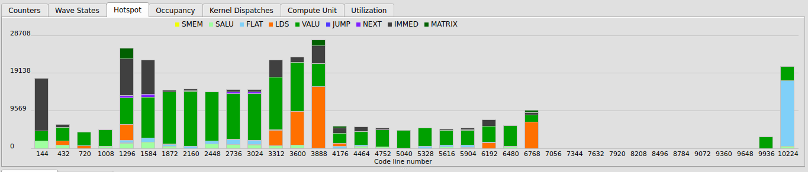
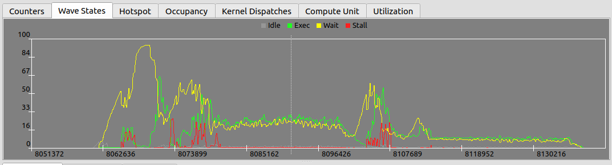
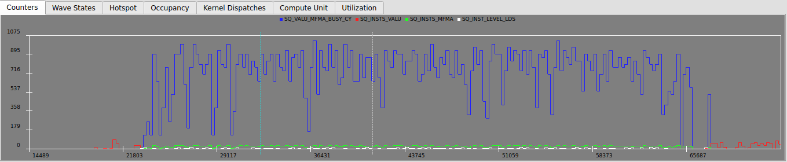
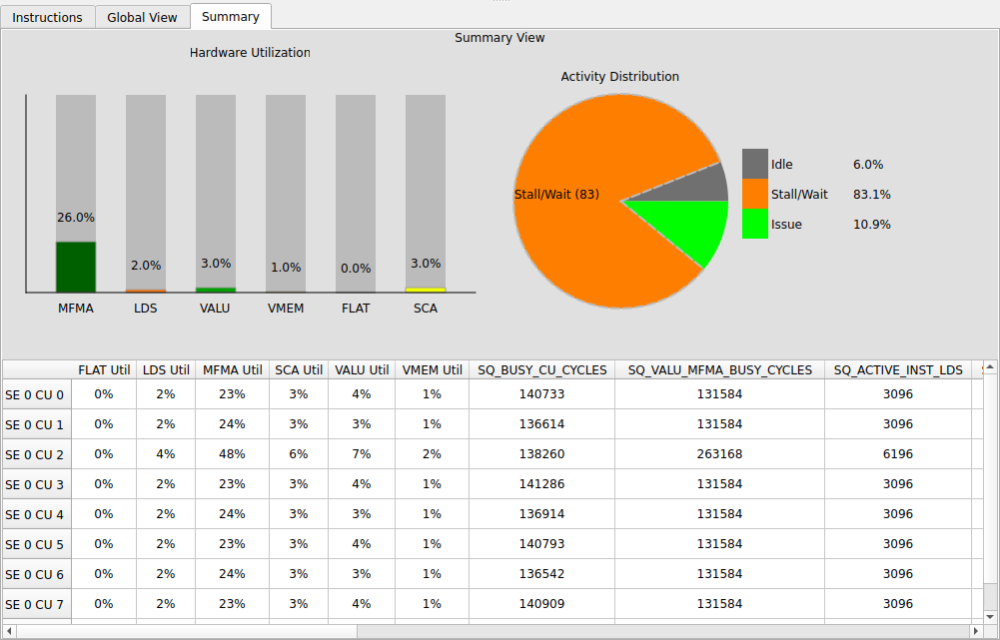

# ROCprof Compute Viewer

ROCprof Compute Viewer (RCV) is a tool for visualizing and analyzing GPU thread trace data collected with rocprofv3.

## Table of Contents
- [Collection](#collecting-thread-trace-using-rocprofv3)
  - [Requirements](#requirements)
  - [Command Line Parameters](#command-line-parameters)
  - [Input File Format](#input-file-format)
  - [Output Format](#output-format)
- [Visualization](#visualization)
  - [CSV Output](#viewing-the-results-of-csv-file)
  - [Rocprof Compute Viewer](#using-the-rocprof-compute-viewer)
    - [Hotspot Tab](#hotspot-tab)
    - [Instructions View](#instructions-view)
    - [Wave States and Plots](#wave-states-occupancy-and-dispatches-plots-tab)
    - [Left Side Panel](#left-side-panel)
    - [Compute Unit and Utilization Views](#compute-unit-and-utilization-views)
    - [Global View](#global-view)
    - [Summary](#summary)
- [Known Issues](#known-issues-and-limitations)
- [Building from Source](#building-from-source)

## Collecting Thread Trace using rocprofv3
* These instructions apply to all supported GPUs, with special attention to the different meanings of SIMD_SELECT on gfx10+ and GFX9.

Rocprofv3 supports two different input formats:
* Command line parameters
* JSON configuration file (similar to rocprofv2's input.txt)

### Requirements
* AQLprofile version ROCm 7.0+.
  * If rocprofv3 errors out with "INVALID_SHADER_DATA", this means the particular version of aqlprofile and Decoder are incompatible.

* Decoder library in:
  * /opt/rocm/lib, or
  * ROCPROF_ATT_LIBRARY_PATH environment variable.

### Command line parameters
The following table compares the rocprofv3 and closest rocprofv2 parameters. Command line parameters use '-' and Json uses '_' for separating words.

| V3 Parameter | V2 Parameter | Type | Range | Typical | Description |
| --------- | --------- | ---- | ----- | ----------- | ----------- |
att-target-cu | att: TARGET_CU | Integer | 0 - 15 | 1 | Defines the CU used to gather detail tokens (WGP on Navi).
att-shader-engine-mask | SE_MASK | Bitmask | 1 - \~0u | 0x11 | Defines for which shader engines to trace. Max at 2^32 - 1.
att-simd-select | SIMD_SELECT | Integer / Bitmask | 0 - 0xF | 0xF | Defines which of 4 SIMDs are going to generate detail tokens. Bitmask on GFX9 and SIMD_ID[0,3] on Navi.
kernel-iteration-range | DISPATCH | List of tuples (v3) | 1 - inf | - | Defines dispatch iteration of the kernel to be profiled. In v3, this is per kernel_id.
kernel-include-regex | KERNEL | String	| Any | - | Includes a kernel name to be profiled.
kernel-exclude-regex | Not supported | String	| Any | - | Excludes a kernel name from profiling.
att-buffer-size | BUFFER_SIZE | Bytes | 1MB-2GB | 96MB | Increase this value if the buffer is getting full too quickly.
att-perfcounter-ctrl | PERFCOUNTERS_CTRL | Integer | 1 - 32 | 2~5 | Enables SQ perfcounters sent to the SQTT buffer with the given relative period (gfx9). High BW: May cause data loss if polled too quickly.
att-perfcounters | PERFCOUNTER | String | SQ | - | Adds SQ counters to be sent when PERFCOUNTERS_CTRL is enabled.

Examples:
```bash
# Use -d to specify the output directory, similar to other v1, v2, and v3 commands.
rocprofv3 --att -d out_dir -- ./a.out
```

```bash
rocprofv3 --att --att-target-cu 1 -- ./a.out
```

<span style="color:red">Important</span>: If kernel filtering and range are not provided, by default rocprofv3 profiles each kernel <span style="color:red">instance</span> once.

### Input file
The JSON input file accepts the same parameters as listed above. Example JSON input:
```bash
{
    "jobs": [
        {
            "kernel_include_regex": "copyD",
            "kernel_exclude_regex": "",
            "advanced_thread_trace": true,
            "att_target_cu": 1,
            "att_shader_engine_mask": "0x1",
            "att_simd_select": "0xF",
            "att_buffer_size": "0x6000000"
        }
    ]
}
```
```bash
rocprofv3 -i input.json -d out_dir -- ./a.out
```

## Output format
rocprofv3 ATT produces three types of output:
* Raw files:
  * .att - Raw SQTT data.
  * .out - Code object binaries.
  * results.json - Generated if "--output-formats json" is specified.
* CSV:
  * Summarizes trace information such as instruction latency costs.
* Rocprof Compute Viewer files:
  * ui_output\_agent\_{agent_id}\_dispatch\_{dispatch_id}
    * agent_id specifies which GPU was profiled.
    * dispatch_id specifies which dispatch was profiled.
    * If desired, these IDs can be checked against --kernel-trace information.

# Visualization

## Viewing the results of CSV file
If the process completes successfully, the stats_*.csv file should include:

| Codeobj | Vaddr | Instruction | Hitcount | Latency | Stall | Idle | Source
| ---- | ---- | ----------- | -------- | ------ | ------ | ------ | -------------
11 | 5888 | s_load_dwordx4 s[40:43], s[0:1], 0x18 | 48 | 276 | 96 | 48 | kernel.py:391
11 | 5896 | s_load_dwordx2 s[38:39], s[0:1], 0x28 | 48 | 192 | 0 | 0 | kernel.py:391
11 | 5904 | s_ashr_i32 s3, s2, 31 | 48 | 260 | 0 | 0 | kernel.py:395
11 | 5908 | s_add_i32 s7, s2, s3 | 48 | 196 | 0 | 0 | kernel.py:395

* Codeobj is the code object load id assigned by rocprofiler-sdk.
* Vaddr is the ELF vaddr.
* Hitcount the number of times that particular instruction was executed, adding all the waves traced and all loop iterations.
* Latency the total latency, defined as the Stall time + Issue time (gfx9) or Stall time + Execute time (gfx10+).
* Stall is the total number of cycles the hardware pipe was busy and could not issue the instruction.
  * Usually caused by hardware unit busy.
* Idle is the total time gap from previous instruction completion to this instruction's start time.
  * Usually caused by arbiter loss, source/destination register dependency or instruction cache miss.
* Source is a reference found via debug symbols. Requires compiling with debug symbols.

Additionally, the viewer includes a wave state called "wait".
* Associated with "IMMED" tokens.
* Wait is defined as a "voluntary stall", in which the wave voluntarily delays issuing of the instruction until a condition of satisfied.
* Common examples:
  * s_waitcnt - waits until a memory dependency is cleared
  * s_sleep and s_nop - waits until a defined amount of cycles passed
  * s_barrier - waits until all waves in a block reach the barrier: "__syncthreads()"
* For the CSV and summaries, 'wait' is considered the same as stall.

## Using the Rocprof Compute Viewer
The Viewer interprets the output of ui_output\_agent\_{agent_id}\_dispatch\_{dispatch_id}. It includes:

* Trace -> ISA -> Source visualization
* Hotspot analysis.
* Memory ops to waitcnt dependency.
* Occupancy visualization

To open a UI directory, use:
* Menu -> Import -> Rocprofv3 UI,
* or paste the full path to "Ui path",
* or launch the viewer from the command line with:

```bash
./rcviewer <dir_to_ui_folder>
```

### Hotspot Tab



The Hotspot tab displays a histogram of instruction costs.

* Vertical axis ("Cycles"): Total accumulated latency cycles for each bin, based on the bin's center value.
* The number of bins and histogram range can be adjusted in Edit → Hotspot Options. Clicking a bin highlights the first and last ISA lines contained in it.
* The hotspot is computed over all waves within the "WaveView Clock Range".
* 'IMMED' instructions (e.g., s_nop, s_waitcnt, s_barrier) may appear to have over-represented cycles since waves in a SIMD often wait concurrently.
* Idle time is not computed into hotspot, only execute and stall.

### Instructions View


The ISA view contains a list of instructions with their Hitcount and Latency cost.
If debug symbols are present, rocprofv3 snapshots the related source files, which are shown on the right.

* The cost can be calculated as a mean or sum of the selected wave, mean or sum of all waves, or display a particular loop iteration.
* Arrows link memory operations to the s_waitcnt waiting on them. They are per-wave: another wave that took a different execution path may present a different set of arrows/links.
* Left or right on the right side of the instruction takes the trace bar to the SQTT token executing that instruction. This is true for Utilization and Compute Unit tabs as well.
* Left click on a token highlights (in green) the ISA line corresponding to that instruction.
* Hover or Click on an ISA line to highlight the corresponding source line. The opposite way is also possible.
  * Clicking on a source line permamently highlights the ISA lines until the user clicks on the same or another line.

### Wave States, Occupancy and Dispatches plots tab
* Keys:
   * Plots can be zoomed in and out with mousewheel
   * Holding Left Ctrl zooms in and out on the vertical axis
   * Click and drag to select an area.
   * Right click and drag for panning.
   * Clicking on a token in the waveview (Trace) will add a blue marker to identify the cycle of that token.
   * The wave states tab shows the number of active waves in each state (IDLE, EXEC, STALL, WAIT)
* The hightlighted region shows what is visible from the "CU" and "Utilization" tabs.

* Wave state tab:
  * Essentially a vertical slice of the Compute Unit tab when looking at wave states.
  * Only for the target_cu



* Occupancy tab shows occupancy per Shader Engine, in number of waves.


* Kernel Dispatches tab shows occupancy per kernel - usually relevant when there are multiple kernels running on different streams.


### Left Side Panel

  
* "Shader" (Engine), "SIMD", "Slot" (Wave slot within a SIMD) and "WID" (A wave ID counter for that slot) boxes allows the user to select which Wave to focus on.
  * This is defined as the target wave.
  * The interations in "Instruction" tab are only for the target wave: Token-to-ISA mapping, loop iteration navigation, etc.
* The WaveView Clock range defines the visible cycles in the "Compute Unit" and "utilization" tabs, as well as the "Hotspot" calculation.
  * By default, set to the first cycle target wave, to a little after the last cycle of the target wave.
  * Reduce the start/end range to make navigation easier.
  * Increase start/end range to see more waves, or get a more general hotspot calculation.
* "GlobalView Zoom" defines the zoom level of the GlobalView tab [0,15].
* "WaveView zoom" defines the zoom level in the trace shown [0,10].
* "Iteration" defines the iteration of the current selected token.
  * Left click on a token to update the iteration.
  * This value can be edited, scrolling the view to same instruction on a different loop iteration
    * Makes navigating loops easier.
    * The iteration is defined as the n-th time that same instruction was executed for each wave (starting at zero).
* "Search" searches for a specific text on the instruction view. E.g. search for ds_ to find the first lds instruction.
* "History" contains the history (token+cycle) of previously selected tokens. It can be used to go back to a previous location.

### Compute Unit and Utilization Views
* Displays the trace aggregated either per-wave (Compute Unit) or per SIMD (Utilization).
* Right click and drag to measure number of cycles.
* Left click highlights the ISA corresponding to that token.
  * If nothing happens, likely that token could not be matched with the ISA. Check for warnings at rocprofv3 output.
* A/D keys can be used for panning.
* Zoom level controlled by "waveview zoom" on left side pannel or Ctrl+MouseWheel.

#### Compute Unit:
* Displays the trace separated per SIMD-Slot (e.g. 2-6).


#### Utilization:
* Displays the trace per type of instruction (VALU, VMEM, SCALAR, OTHER).
* Hides IMMED type tokens as multiple waves can be executing them in parallel.
* Hides stalled time, displays only issue (gfx) or execution (gfx10+).
* Can be used to identify bubbles.
* May have overlapping tokens from different waves slots, in that case only one will be displayed.


### Counters:
* Displays a plot of counter collection over time
  * Up to 8 counters can be added, with 4 recommended
  * Only SQ counters are allowed.
  * On Mi300, "--att-perfcounter-ctrl 3" has a polling rate of 120~240 cycles
* Syntax in rocprofv3:
```bash
rocprofv3 --att-perfcounter-ctrl 3 --att-perfcounters "SQ_VALU_MFMA_BUSY_CYCLES SQ_INSTS_VALU SQ_INSTS_MFMA SQ_INST_LEVEL_LDS"
```
* Alternatively, one can define SIMD Masks in which counters only increment for a particular SIMD:
  * Use ":0xMask"
  * Default to 0xF (all SIMDs increment counter)
  * By filtering SIMD and CU (in Edit -> Counters Shown), this allows per-SIMD counter collection streaming
```bash
rocprofv3 --att-perfcounter-ctrl 3 --att-perfcounters "SQ_INSTS_VALU SQ_INSTS_SALU:0xF SQ_INSTS_SALU:0x3 SQ_INSTS_SALU:0xC"
```

Counters can be used to visualize specific types of hardware utilization. For instance:
* SQ_INST_LEVEL_LDS - Measures current number of in-flight LDS instructions.
* SQ_VALU_MFMA_BUSY_CYCLES - Measures current MFMA hardware utilization.

Counters are also collected per compute unit and per shader engine.
* Use Menu -> Edit -> Counters shown to define which Shaders/CUs are plotted.
* Deselect all compute units except '1' to visualize counters only for CU=1.
  * '1' is usually the default --att-target-cu




#### Global View
The Global View presents a comprehensive trace of all waves across enabled Shader Engines, with each wave color-coded by kernel.

* Hovering over the trace display additional information, such as which kernel that wave is running, the cu/simd/slot and wave duration.
* The "Global View" can be compared with the Kernel Dispatches plot.
* Right click and drag to measure number of cycles.


#### Summary
The summary is a feature availble only on MI2xx and MI3xx GPUs. It displays 3 pieces of information:
* Average instruction cost for the whole trace, separated by idle, issue and stall.
* Average hardware utilization by instruction type (VALU, VMEM, LDS, ...)
* Per-compute hardware utilization values and accumulated counters.

To enable the summary view, use the following parameters:

```bash
# SQ_ACTIVE_INST_X collects activity for token type X.
# For summary, a collection interval of 15 is enough.
rocprofv3 --att-perfcounter-ctrl 15 --att-perfcounters "SQ_BUSY_CU_CYCLES SQ_VALU_MFMA_BUSY_CYCLES SQ_ACTIVE_INST_VALU SQ_ACTIVE_INST_LDS SQ_ACTIVE_INST_VMEM SQ_ACTIVE_INST_FLAT SQ_ACTIVE_INST_SCA SQ_ACTIVE_INST_MISC"
```



## Known issues and limitations
* All:
  * Rocprofv3 can fail to generate traces if the target_cu is empty.
  * Thread trace cannot be used alongside host trap mechanisms. This includes:
    * Host trap PC Sampling.
    * Shader debugger.
* gfx9 - MI200, 300, 350:
  * The latency of IMMED type tokens is approximate.
    * Decoder considers the initial wait time of IMMED to be the first cycle is could have executed.
    * This is likely but not guaranteed.
    * The end time, however, is exact.
* gfx10/11/12 - Radeon 6000/7000/9000:
  * Wave64 is currently not supported.
  * s_barrier/s_barrier_wait latency is approximate.

## FAQ:

1) The Viewer does not display anything except "Occupancy" and "Global View". There are also no wave files on the ui_output directory.
*  
  * Thread Trace only receives detailed information from the target_cu.
  * If the application does not populate the target_cu, then nothing will be traced.
  * Possible solutions:
    1) Launching more waves
    2) Set the --att-shader-engine-mask to 0x11111111, or possibly to 0xFFFFFFFF
      * Too high of a number can cause packet losses. See (2).
    3) Use the HSA_CU_MASK setting here to mask out all CUs but the target: https://rocm.docs.amd.com/en/latest/how-to/setting-cus.html

2) rocprofv3 Warnings:
* 
  * "Stitch Incomplete":
    * This could be a bug in the decoder. Please report it to us.
    * The trace is still valid, but some tokens won't be matched with the ISA.
    * It could also be caused by insufficient buffer size or packet losses, see next item.
  * "Packet loss" or "Data loss"
    * This is caused by too high memory traffic coming from the application + thread trace.
    * Possible solutions:
      1) Set --att-shader-engine-mask to 0x1
      2) (gfx9) Set --att-simd-select to a lower bitmask than 0xF. You can go as low as 0x1.
      3) It is sometimes also caused by the buffer getting full.
        * Increase buffer size with --att-buffer-size

## Building from source

By default, the project builds with QT 6.8.
To build with QT5, use:
```bash
cmake -DQT_VERSION_MAJOR=5 ..
```
For QT 6.4, use:
```bash
cmake -DQT_VERSION_MINOR=4 ..
```

### MacOS (Homebrew)

Install Qt5 or Qt6:

```bash
brew install qt@5
brew install qt@6
```

Configure CMake and build:
```bash
mkdir build
cd build
cmake .. -DCMAKE_PREFIX_PATH=$(brew --prefix qt@6)
# or
cmake .. -DQT_VERSION_MAJOR=5 -DCMAKE_PREFIX_PATH=$(brew --prefix qt@5)
make -j
```

### Linux

Install Qt5 (or similar instructions for Qt6):

```bash

# Ubuntu 22.04
sudo apt install -y qtbase5-dev qt5-qmake cmake build-essential

# Ubuntu 24.04
sudo apt install -y libgl1 qtbase5-dev qt5-qmake cmake build-essential

# For other distributions, please follow https://doc.qt.io/qt-5/gettingstarted.html
```

Configure cmake and build:

```bash
mkdir build
cd build
cmake .. -DQT_VERSION_MAJOR=5
# for qt6.4, use
# cmake .. -DQT_VERSION_MAJOR=6 -DQT_VERSION_MINOR=4
make -j
```

### Windows WSL

* Requires Ubuntu 22+
* Follow the same instructions for Linux.
* Recommended to use Qt5.15.

### Windows Native

To build on Windows, use QT Tools with QT-6.8+:
* https://wiki.qt.io/Quick_Start:_Installing_Qt_on_Windows

### Disabling openGL widgets

```bash
cmake .. -DRCV_DISABLE_OPENGL=On
```
